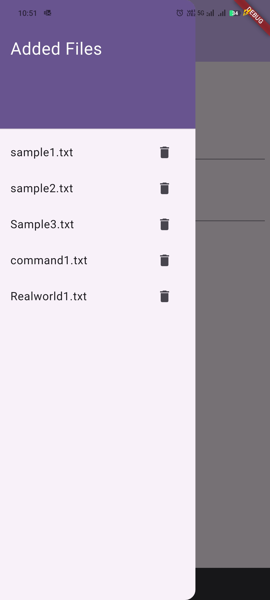
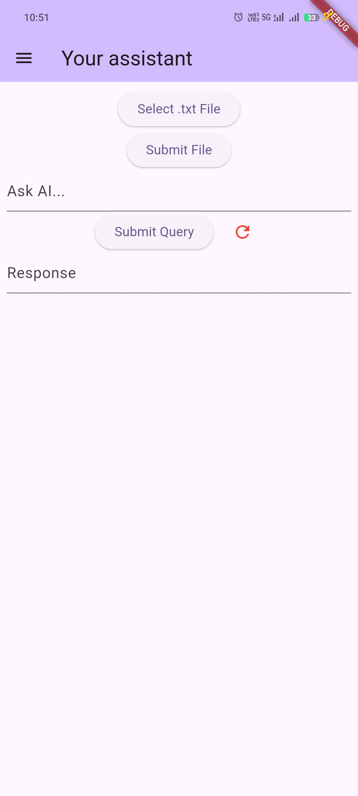
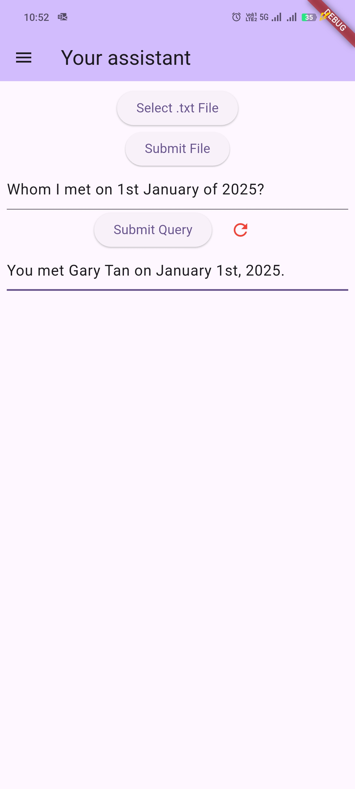

# Meeting Assistant

A Flutter application designed to help you retrieve information from past meetings effortlessly. It leverages Retrieval-Augmented Generation (RAG) with LangChain to provide accurate responses to your queries.

Simply upload meeting transcripts along with timestamps, and the app will store them in an on-device persistent database. This ensures that you can search and retrieve details from any past meeting whenever needed. The assistant acts as your personal meeting archive, preserving all essential information.

### Features Added:
- Upload and store meeting transcript files.
- Process transcripts using OpenAI's LLM and save them in a vector database.
- Query specific details about past meetings.
- Maintain context during conversations for a seamless user experience.
- Option to delete meetings from database.
- Option to reset current context of conversation.

### Screenshots

